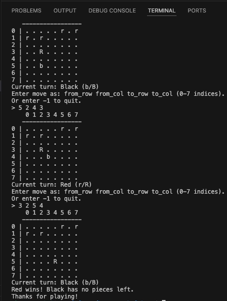
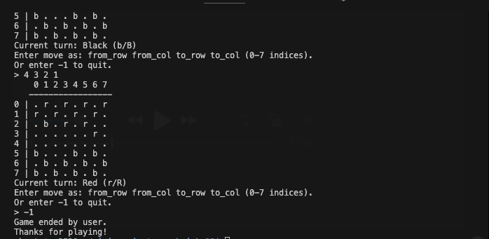
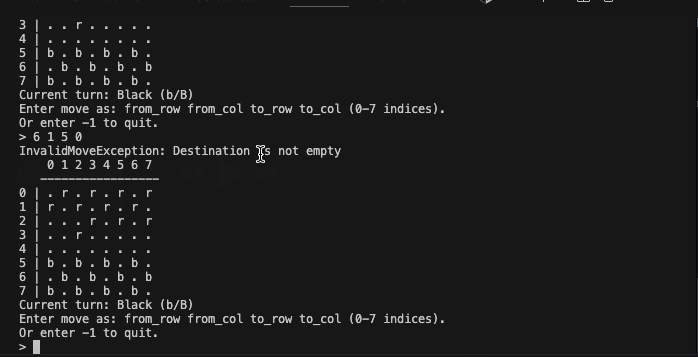
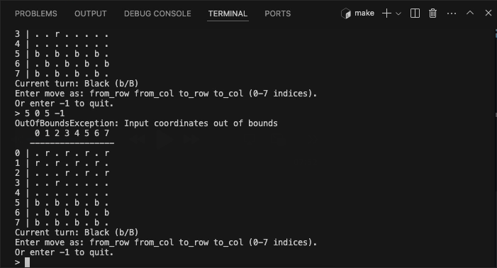

# Terminal Checkers (CS3520 Final Project)

A fully playable Checkers game that runs in the terminal. The game supports standard diagonal movement, capturing (jumps), king promotion, turn-taking, and win detection (when a player has no pieces left). The game functions exactly how a standard checkers game does.

---
## Features

- **8x8 checkers board** printed in the terminal with row/column indices.
- **Two players**: Red (`r` man, `R` king) vs Black (`b` man, `B` king).
- **Legal move validation**:
  - Pieces can only move diagonally to valid squares.
  - Captures remove opponent pieces correctly.
- **Jump capturing**, 2-square diagonal move that removes the jumped piece.
- **King promotion**:
  - Red promotes upon reaching row `7`.
  - Black promotes upon reaching row `0`.
- **Game over detection**:
  - A winner is declared when the opponent has no pieces remaining.
- **Robust input handling**:
  - Invalid moves and out-of-bounds moves are rejected with clear error messages.
  - Input failure states are handled so the program does not get stuck repeating errors.

## Project Layout

This project follows the class starter structure:

- `src/` : all `.cpp` source files (including `main.cpp`)
- `include/` : all `.hpp` header files
- `bin/` : compiled executables (created by the Makefile)
- `build/` : intermediate object files (created by the Makefile)
- `screenshots/` : pictures for README.md

## Build and Run

From the repository root, run the following in the terminal:

```bash
make clean
make run
```
## How To Play

### Board Symbols
- r = Red man
- R = Red king
- b = Black man
- B = Black king
- . = empty square

### Turns
The game alternates turns:
- Red moves first
- The terminal prints the current turn each round.

### Move Input Format
When prompted, the user must enter the starting coordinate of the piece they would like to move, followed by the ending coordinate of where they would like that piece to be moved. The following is the exact formatting needed:

```bash
from_row from_col to_row to_col
```
All values must be integers in the range 0 to 7.
Example move:
```bash
2 1 3 0
```
### Quit
To quit, the user must enter `-1`

### Win Condition
The game ends when one player has no pieces remaining on the board. The winner is printed to the terminal.

## Concept Mapping
This project was designed to demonstrate several course concepts, including:
- 2D built-in array passed into a function
  - The board is represented and printed using a C-style 2D array (and a helper function that takes it as a parameter).
- Throwing and catching at least two types of exceptions
  - Invalid moves and out-of-bounds moves throw distinct exception types that are caught in the game loop.
- Class with access specifiers, constructor, destructor
  - The board and piece classes use proper encapsulation and manage lifetime correctly.
- Inheritance and polymorphism
  - Piece types (Man/King) share a base interface and override behavior such as legal move generation.
- Manual dynamic memory (new/delete)
  - Board tiles store dynamically allocated Piece objects and clean them up safely.
- STL container, not vector/string
  - Legal moves are collected and returned using std::list.
## Pictures

### Winning the Game


### Quitting the Game


### Invalid Move Handling


### Out-of-Bounds Handling

